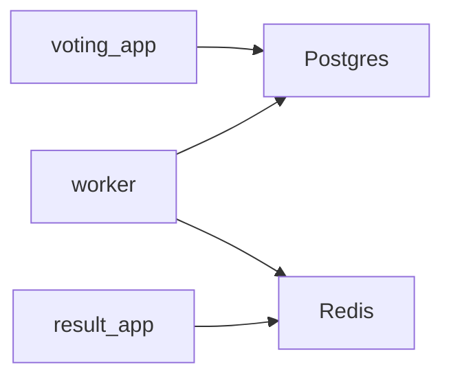

# example-voting-app




## Usage

### Minikube

```bash
# Run the minikube
minikube start --driver qemu --network socket_vmnet
# Stop the minikube
minikube stop
# Get a linked IP to app (through a serivce)
minikube service SERVICE_NAME --url
```

```bash
# Create a pod or deployment
kubectl create -f LINK_TO_YAML_WITH_CONFIGURATION
# Delete a pod or deployment
kubectl delete -f LINK_TO_YAML_WITH_CONFIGURATION
# Get list of pods, services and deployments
kubectl get po,svc,deploy
# Scale a deployment replicas from current value to NUMBER
kubectl scale deploy DEPLOYMENT_NAME --replicas=NUMBER
```

## Links
- [dockersamples/example-voting-app](https://github.com/dockersamples/example-voting-app)
- [rotoro-cloud/example-voting-app](https://github.com/rotoro-cloud/example-voting-app)
