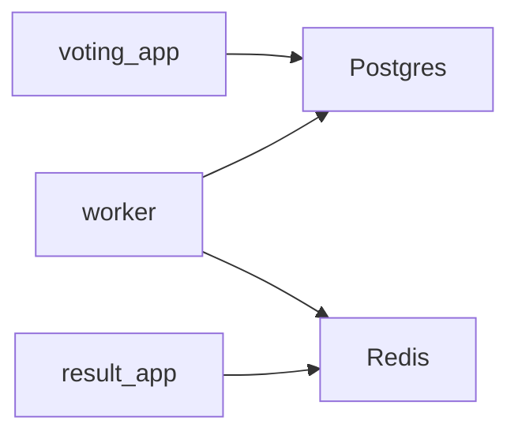

# example-voting-app

## Links
- [dockersamples/example-voting-app](https://github.com/dockersamples/example-voting-app)
- [rotoro-cloud/example-voting-app](https://github.com/rotoro-cloud/example-voting-app)
